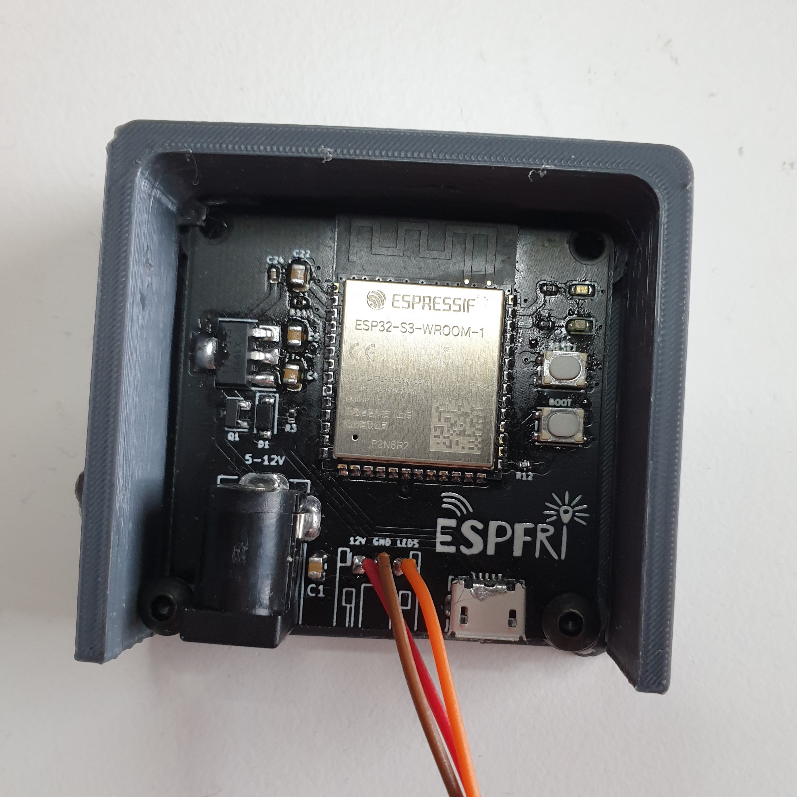

# ESFRI

Extend your IKEA Trådfri smart home.

---

This repository contains source code and 3D model files for *ESFRI*, which is a PCB that is based on the ESP32-S3, and allows you to control LED strips with IKEA's smart home Trådfri system. The Trådfri Gateway communicates with ZigBee to nodes such as light bulbs, but it is possible to control and get status from the nodes via the gateway, using the COAPS protocol. This way, there is no need to use any ZigBee modules, as it's possible to retrieve light bulb data through the Trådfri gateway.

ESPFRI works like follows:

1. Connect `12V`, `GND` and `LEDS` to the led strip. (There is room for a JST connection, but I soldered mine directly)
2. Once the ESP32 boots it connects to WiFi.
3. The ESP32 continously polls the Trådfri Gateway using COAPS protocol, for the status of a specific light bulb.
4. The status of the light bulb is then used to control the led strip.

## PCB
The PCB has a DC jack that expects 5-12V input, which is the voltage that is given to the led strip. There is an on-board LDO which outputs 3.3V for the ESP32. There is also a USB connection to program the ESP, as well as two buttons and two on-board LEDs.

---
## Coap
Big thanks to [ikea-tradfri-coap-docs](https://github.com/glenndehaan/ikea-tradfri-coap-docs), which I used understand the tradfri gateway communication.
